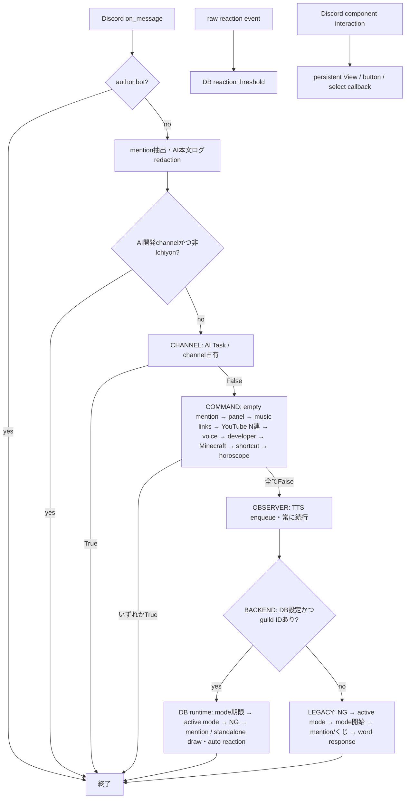

# Message routing — Phase 1

## Scope and choice

調査基準: `e07c53d` (2026-09-28 の origin/main)。モノレポ、Bot / bot-irsia / admin、DB、外部API、production設定は維持する。message経路だけを抽出し、service内部の判定・副作用は維持する。

| 方式 | 評価 |
| --- | --- |
| command文字列→関数のRouter | freeform AI、DB反応、mode、TTS observerを扱うために既存parserの再実装が必要 |
| 登録順だけのregistry | mainは薄くなるがPythonの並び順への依存が残る |
| priorityだけ | 単純だがchannel占有・observer・backendの境界が不明瞭 |
| **phase＋priority registry（採用）** | 既存handlerをそのまま接続でき、順序・所有権を明示できる |

`main.py` は起動・イベント・既存定期task・dispatchを担当する。`bot/message_router.py` はDiscord非依存の順序と短絡契約、`bot/message_routing.py` はservice接続・registry・既存legacy mention処理を担当する。`bot/messages.py` はmention抽出と送信のまま。service内のDB runtime順序はPhase 1では変更しない。

## 全体図

## 調査一覧・processing phase / priority

番号は旧`on_message`の実行順。phase内のpriorityが小さいほど先。全てのcommand handlerはTrueなら停止、Falseなら次へ進む。エラー応答・権限拒否・feature OFFも「その機能が処理を所有した」ならTrueであり、成功だけを意味しない。

| 旧順 | phase:priority / route | handler / 機能 | 戻り値と競合・fallback |
| --- | --- | --- | --- |
| guard | dispatch前 | bot投稿無視、mention抽出、AI redaction、Irsia channel除外 | bot投稿とAI channelのIrsiaは終了。サービスへ渡さない |
| 1 | CHANNEL:10 ai_task | `handle_ai_task_channel_message` / AI受付・状態・一覧 | 指定channelのIchiyonは権限拒否・DB無効・不正入力もTrue。channel外False。通常文も依頼なので全commandより先。adapterはchannel内Falseでも後続へ流さない |
| 2 | COMMAND:10 empty_mention | `handle_empty_mention_message` / 空mentionの既存DB応答 | guild＋空mention＋DB時だけruntimeを試す。runtime Trueなら終了、Falseならpanel以降へ。末尾DBで再試行する旧挙動も保持 |
| 3 | COMMAND:20 context_panel | `handle_context_panel_command` / root・game・audio・musicパネル | mentionまたはstandaloneの完全一致。曖昧文はFalse。空mentionを汎用panelにしない。音楽/音声等はvoiceやDB shortcutより先 |
| 4 | COMMAND:30 music_links | `handle_mention_music_links` / mention内URL再生 | mention・guild・対応URL・VC状態等に従いbool。未接続等で未処理ならN連以降へ。URL含むコマンドとの競合はこの順を保持 |
| 5 | COMMAND:40 youtube_n_pull | `handle_youtube_n_pull_command` / presetのN連 | DB preset一致を判定。未一致False、所有した入力エラーや無効化はTrue。voice/shortcutより先 |
| 6 | COMMAND:50 voice | `handle_voice_command` / TTS設定・Music操作・VC入退室・音声 | 内部はTTS command → music parser → voice parser。未一致False。stopはmusic停止を先に試す。TTS observerとは別 |
| 7 | COMMAND:60 developer | `handle_developer_command` / dev限定mode・年次テスト | mention判定後、環境・許可user guard。productionはFalse。許可済み対象commandはTrue。voiceに同時一致ならvoice優先 |
| 8 | COMMAND:70 minecraft | `handle_minecraft_command` / bridge・管理command | mention parserの結果を使用。Minecraft prefixを所有したusage・権限拒否・利用不可もTrue。DB shortcutや汎用mentionに同文を登録してもこちらが先 |
| 9 | COMMAND:80 mention_shortcut | `handle_mention_shortcut_command` / DB完全一致shortcut | bot/guild scope・feature flagを保持。未一致/lookup失敗False。一致後は価格・audio等を処理してTrue。horoscopeと重複した登録はshortcut優先 |
| 10 | COMMAND:90 horoscope | `handle_horoscope_command` / 占い・星座 | mention必須、parser未一致False。無効設定は無返信True、取得失敗も応答してTrue。DB通常mentionを抑止 |
| 11 | OBSERVER:10 tts | `maybe_enqueue_tts` / 通常本文読み上げ | service boolはenqueue成否。旧コードは無視していたためadapterは必ずFalse。後続のDB/legacy応答と共存 |
| 12 | BACKEND:10 db_runtime | `handle_db_runtime_message` / DB runtime全体 | DB＋guildならserviceのTrue/Falseに関係なくrouterはTrue。DB障害・未一致でもlegacy JSONへ落とさない。DB以外/DMはFalse |
| 13 | LEGACY:10 ng_word | `contains_ng_word` / legacy NG | 一致なら無返信終了(True)。command/TTSより後。DB内NGはruntime側の順序を保持 |
| 14 | LEGACY:20 mode | `hayusu.handle_mode_message` / active mode | Trueで停止。NGより後、通常mentionより先 |
| 15 | LEGACY:30 mode_start | `hayusu.maybe_start_hayusu_mode` / mode開始 | Trueで停止。active modeが先 |
| 16 | LEGACY:40 mention | `handle_mention_message` / くじ・通常quote | bot mentionなしFalse。N連禁止構文False、入力エラーTrue、くじ送信True。通常mentionはquoteなしでもTrue（word responseへ流さない） |
| 17 | LEGACY:50 word_response | `handle_word_response` / 単語auto response | 一致True、未一致Falseで終了 |

AI channel以外では`messages.get_mention_command_text`はbot mentionを除去してstrip、非mentionはNone。AI channelではIchiyonの**先頭mentionのみ**を除去し本文中のmentionや空白を保持する。これを共通command parserに置き換えない。AI commandをchannel外で新規受付する変更もしていない。

### AI channelとIchiyon / Irsia

現行mainに「AI Taskより先の明示command」はない。`音楽`、Minecraft、Voice、horoscope等もAI channel内なら依頼本文である。Phase 1で例外を足すと外部挙動が変わるので追加しない。テストは明示command風本文を含めchannel占有を固定する。Irsiaは同channelを無視し、他channelは既存のbot IDごとのrepository・feature flag・設定を使う。共通routerにIchiyon専用の機能制限を追加しない。

### Interaction / Voice / Minecraftとの境界

panelの送信入口だけがmessage registryに属する。componentのbutton/select callbackとpersistent View登録、raw reaction thresholdは別eventでありregistryに移さない。Voice/Music/TTSのsession・queue・mixer・権限判定は既存serviceが所有する。shortcutやDB effectもaudioを再生し得るがrouterが再生優先度を管理するわけではない。Minecraftは既存bridge/Control APIを呼ぶserviceのまま。外部API、pack、DB schemaは変更しない。

## 契約と競合ルール

- registry handlerは`async (message, command_text) -> bool`。True=消費、False=後続へ委譲。Noneや独自truthy値は登録ミスとしてTypeErrorにする。
- `(phase, priority)`でsort。同じnameまたは同phaseの同priorityは起動時ValueError。Python定義・登録の並び順で競合を解決しない。
- 最初のTrueで停止。並列dispatchしない。例外は従来通りDiscord event error handlingへ伝播し、別handlerで隠さない。
- channelの占有 → 明示command → 非占有observer → backend所有権 → legacy fallback。DB内処理の順序をrouter側で重複させない。
- 新しい競合例外は既存挙動変更として別途設計し、両方が一致する入力の回帰テストを先に書く。

## 新handler追加手順

1. 対象serviceにhandlerを書く。未一致は副作用なしFalse、所有したrequest（エラー返信を含む）はTrue。既存handlerが別の契約なら小さなadapterで変換する。
2. `bot/message_routing.py`の`build_message_router()`へ`Route`を1件追加する。mainの変更は不要。
3. 目的に応じたphaseと未使用priorityを選ぶ。例: 独立した「成田モーフィング」mention機能ならCOMMAND:75でMinecraftの後・DB shortcutの前。Minecraftサブcommandである場合は既存Minecraft parser/serviceに追加しrouteを増やさない。
4. 前後のhandlerと同じ入力を解釈し得るか確認し、選んだ優先順位をテストにする。AI channelには通常commandを通さない。
5. `scripts/check_message_router.py`の順序・短絡テスト、該当機能の実handler check、`check_mention_on_message_routing.py`を更新/実行する。Irsia・DM・DB miss・TTS継続も確認する。

## 検証

`check_message_router.py`はproduction registryを逆順に渡しても順序が不変であること、全routeの短絡、False fallback、重複登録/不正戻り値/例外、AI channel所有、bot除外、両instance、DM、空mention、Minecraft/Voice/Music等の接続、TTS observer、DB terminal、NG/mode/通常mentionを検証する。

`check_ai_task_discord_channel.py`は実AI serviceとfake DBで受付・拒否・role mention・通知・redactionを検証する。既存mention routing checkと各serviceのcheckも実行する。以前のソース行番号依存checkにはpanel/shortcutの旧順序と廃止されたAI入口参照が残っていたため、実registry/dispatchを検証する形へ移行した。

`check_message_router_db.py`はCI専用の固定localhost PostgreSQLにfixtureを作り、production registryと実DB runtimeで両Botの応答分離・未一致時のlegacy抑止を確認する。既存`check_v2_db_integration.py`も実行したが、migration 031以前の`ON CONFLICT (guild_id, count_key)`等を前提としており、現行schemaではfixture準備時に失敗する。Phase 1ではschemaやこの旧データ依存checkを作り直さず、専用checkをCIへ追加する。
